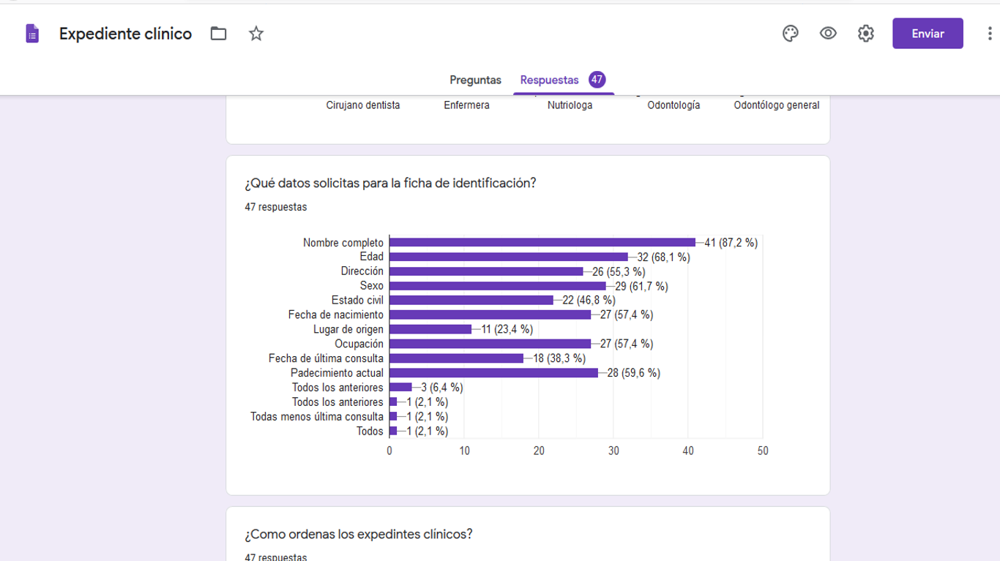
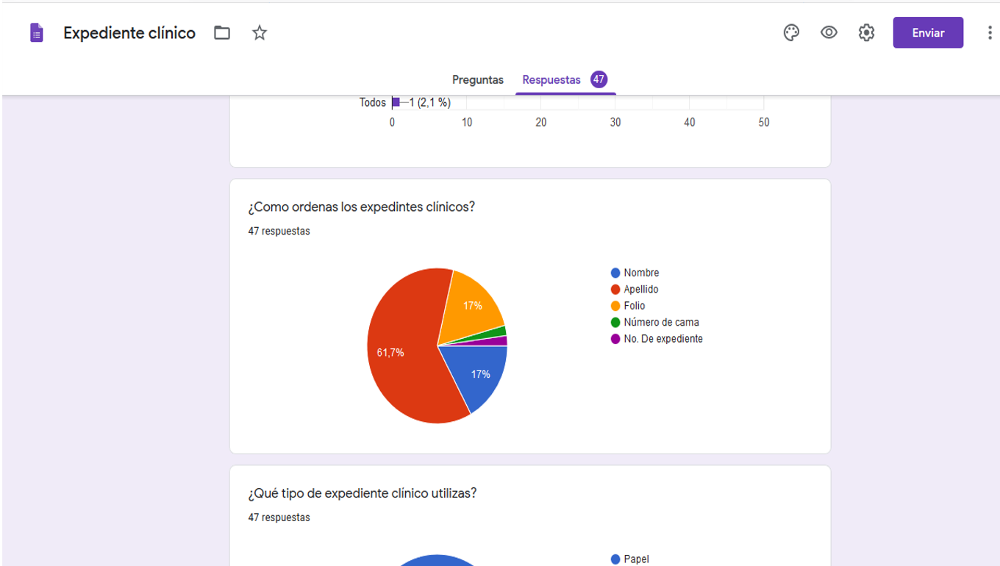
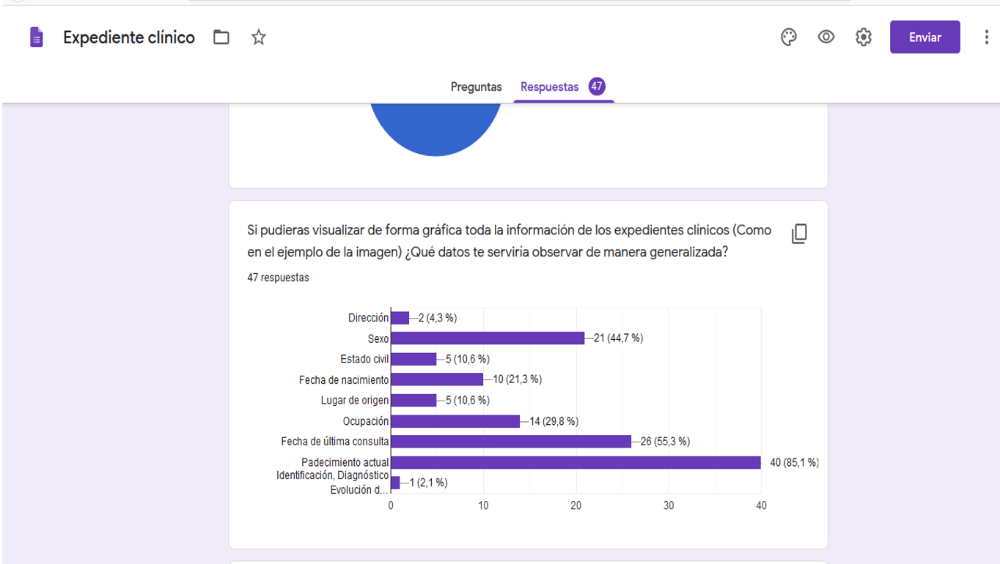
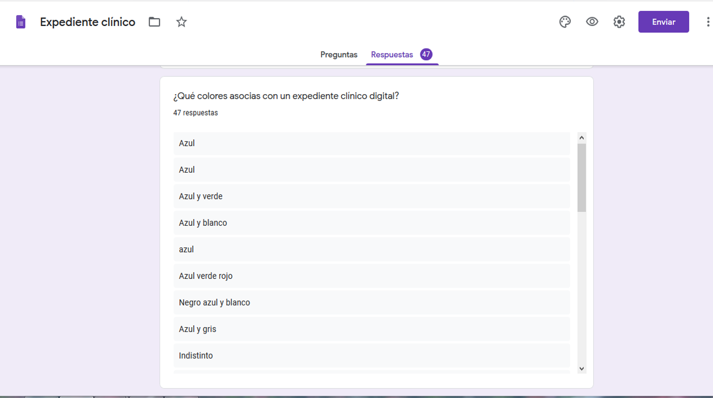
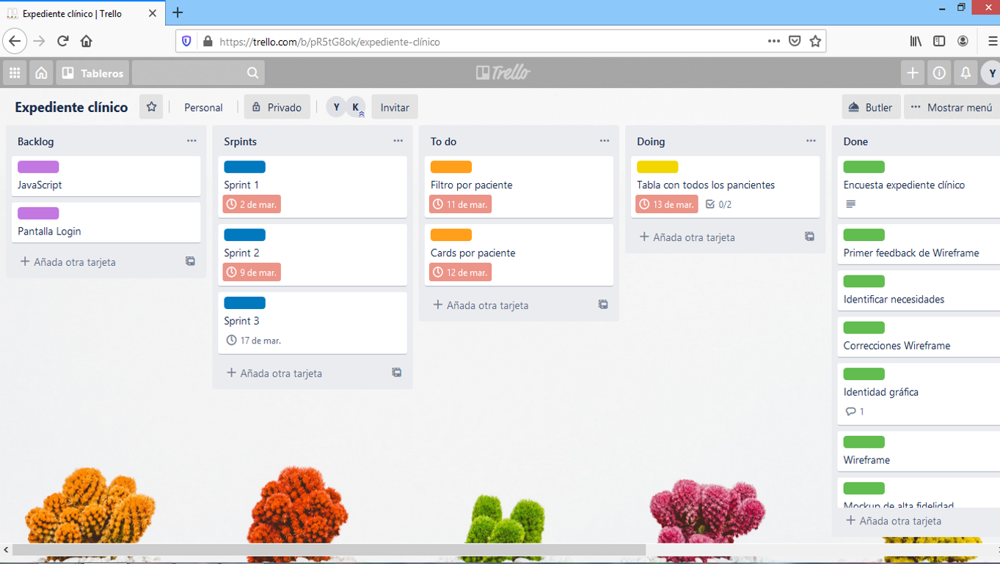
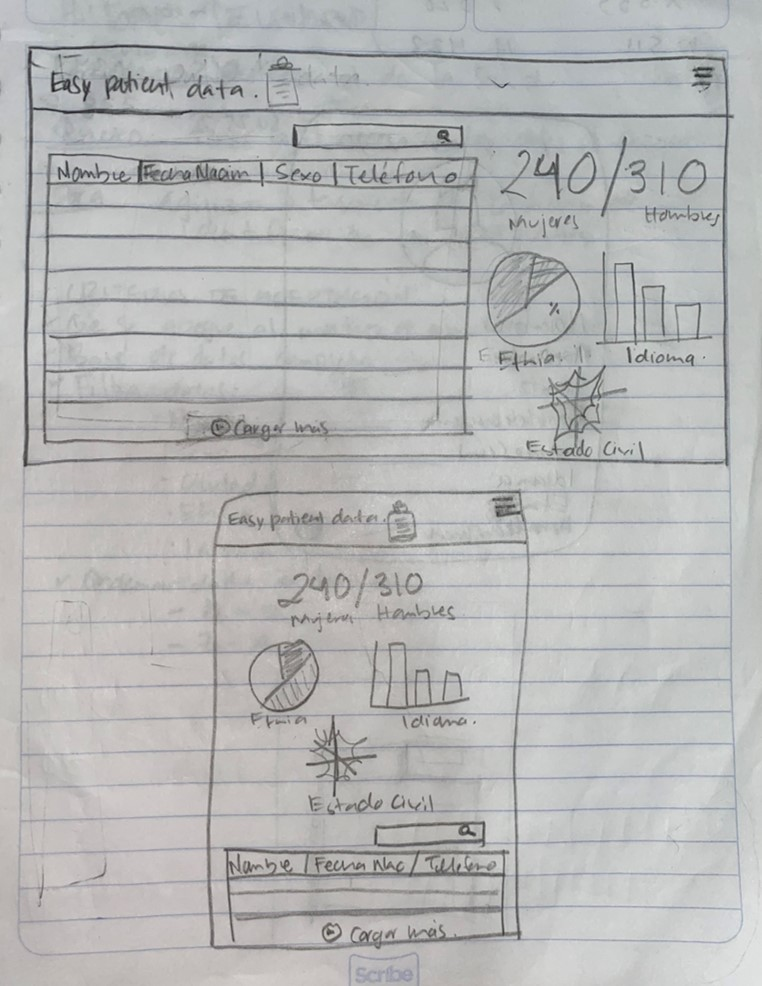
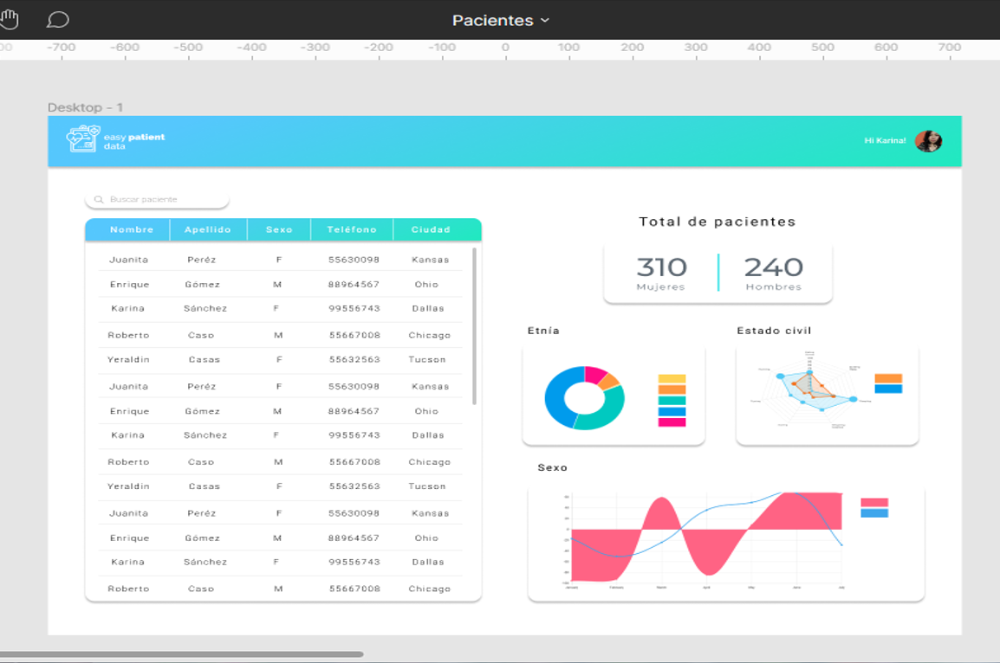

# :syringe: EASY PATIENT DATA

### :bulb: PROCESO CREATIVO

 El primer paso fue elegir el tema entre las bases de datos que nos fueron proporcionadas. Decidimos trabajar con "Pacientes en EEUU" porque consideramos que ordenar una base de datos así tiene mucha utilidad en el área de los profesionales de la salud.

[Pacientes en EEUU](src/data/patient/patient.json).
 Este set nos proporciona una lista de pacientes de EEUU. Puedes revisar la documentación de su API en este [link](https://r2.smarthealthit.org/Patient).
 
Una base de datos de fácil acceso y consulta sobre pacientes podría ser útil a cualquier área de la salud (medicina, enfermería, estomatología, optometría, psicología, farmacéutica, nutrición, etc...)sin importar si los profesionales de las áreas pertinentes se dediquen a la práctica pública o privada. 
  
 

### :question: ESTUDIO DE USUARIOS
 
Nuestro segundo paso fue realizar una encuesta a diversos profesionales de la salud para identificar que datos sobre los pacientes eran más importantes o útiles a la hora de organizar una base de datos médica. Hicimos la encuesta con la finalidad de acercarnos a los usuarios,conocer sus necesidades y perspectivas al momento de utilizar como herramienta de trabajo una base de datos digital.

A continuación el cuestionario:
 
 
 
 
 
 
 

### :pencil: RESULTADOS

Entre los profesionales que repsondieron el cuestionario se encuentran: Odontólogos generales, Odontopediatras, Endodoncistas, Nutriológas, Enfermeras, Psicólogos, Médicos y Optometristas.
 

Los datos que solicitan a un paciente para poder llenar una ficha de indentificación son: nombre, edad, dirección, sexo, fecha de nacimiento, estado civil. 
 

En un 61.7% el personla del área de la salud expresó que ordenan los expedientes por apellido del paciente. 
 

El 87.2% dijo que utiliza un expediente clínico de papel y solo el 12.8% utiliza expedientes clínicos digitales.

Padecimiento actual, sexo, fecha de última consulta y lugar de origen son los datos que podrían observarse de manera estadística en las bases de datos médicas.

Los colores que más relacionaban con expediente clínico digital fueron: azul,verde y blanco. Los cuales fueron tomados a la hora de diseñar la interfaz de usuario. 
 

La última pregunta se colocó para poder implemenar en una futura base de datos, según las necesidades específicas de cada profesional.
 

### :rotating_light: PROBLEMÁTICA

El personal del área de la salud se enfrenta día a día al procesamiento y consulta de datos en grandes cantidades, ya sea por el número de pacientes que maneja o por los datos que recolecta de cada paciente; lo cuál puede tornarse en una difícil organización, fastidio y descuido en la base médica de datos. Además por los resultados de la encuesta que realizamos el personal médico no está muy cerca de lo digital ni de las nuevas tecnologías cuando a administración se refiere. 

### :computer: ¿QUÉ PROPONEMOS?

Una base digital de datos médicos para facilitar las tareas de administración y consultoría de pacientes en un consultorio pequeño, una clínica y hasta un hospital.  

### :hourglass_flowing_sand: ¡MANOS A LA OBRA! 
Para poder tener una distribución homogénea sobre las tareas a realizar nos apoyamos de la herramienta Trello, así nuestro SCRUM podía ser consultado y modficado por cualquiera de la dos integrantes del equipo.
 

### :bust_in_silhouette: HISTORIAS DE USUARIO 

:one: 

YO: como profesional de la salud.

QUIERO: tener fácil acceso a los datos de pacientes.

PARA: agilizar la búsqueda de la ficha de identificación de pacientes. 

:two:

YO: como usuario de Easy Patient Data

QUIERO: poder visualizar la página web en cualquier dispositivo

PARA: que los datos de los pacientes sigan siendo de fácil consulta

:three:

YO: como usuario de Easy Patient Data

QUIERO: elegir en la versión móvil entre ver las gráficas o la tabla

PARA: no saturarme de información en una pantalla pequeña

:four: 

YO: como usuario de Easy Patient Data

QUIERO: poder buscar cada paciente de manera individual

PARA: tener acceso a los datos completos del paciente 

### :heavy_check_mark: CRITERIOS DE ACEPTACIÓN 
-Que se apregue al mockup de alta fidelidad
-Base de datos completa
-Filtrar datos: id, nombre, apellido, sexo, fecha de nacimiento, fecha de muerte, dirección, teléfono, fecha de muerte, etnía, idioma. 
-Consultar y encontrar datos individuales de cada paciente. 

### :vhs: WIREFRAME
Durante esta etapa diseñamos con lápiz nuesra interfaz de usuario, ordenamos los datos en base a los resultados del cuestionario, pensamos el nombre de nuestra aplicación web,la distribución de los elementos a consultar y cómo se vería la pantalla de la aplicación funcionando en una pantalla de escritorio y en una pantalla de celular. 

 

 

Buscamos el feedback en tres ocasiones de nuestros coach y también de nuestras compañeras de bootcamp. 

### :iphone: MOCKUP DE ALTA FIDELIDAD 
Para poder desarrollar esta parte aplicamos el feedback que nos dieron nuesros coach y nuestras compañeras, así como también tomamos en cuenta los colores que el personal de salud dijo asociar más a un expediente clínico digital los cuales fueron: azul, verde y blanco. El mockup se desarrolló en Figma.

Se desarolló el mockup para pantalla de teléfono celular 

Se desarrolló el mockup para pantalla de escritorio 

### :pushpin: OBJETIVOS DE APRENDIZAJE

 **UX**
- [x] Diseñar la aplicación pensando y entendiendo al usuario.
- [x] Crear prototipos para obtener _feedback_ e iterar.
- [x] Aplicar los principios de diseño visual (contraste, alineación, jerarquía).
- [ ] Planear y ejecutar _tests_ de usabilidad.

**HTML y CSS**
- [x] Entender y reconocer por qué es importante el HTML semántico.
- [x] Identificar y entender tipos de selectores en CSS.
- [x] Entender como funciona `flexbox` en CSS.
- [x] Construir tu aplicación respetando el diseño planeado (maquetación).

**DOM**
- [X] Entender y reconocer los selectores del DOM (querySelector | querySelectorAll).
- [X] Manejar eventos del DOM. (addEventListener)
- [X] Manipular dinámicamente el DOM. (createElement, appendchild, innerHTML, value)

**Javascript**
- [X] Manipular arrays (`filter` | `map` | `sort` | `reduce`).
- [X] Manipular objects (key | value).
- [ ] Entender el uso de condicionales (`if-else` | `switch`).
- [X] Entender el uso de bucles (`for` | `forEach`).
- [ ] Entender la diferencia entre expression y statements.
- [ ] Utilizar funciones (parámetros | argumentos | valor de retorno).
- [ ] Entender la diferencia entre tipos de datos atómicos y estructurados.
- [X] Utilizar ES Modules (`import` | `export`).

**Pruebas Unitarias (_testing_)**
- [ ] Testear funciones (funciones puras).

 **Git y GitHub**
- [x] Ejecutar comandos de git (`add` | `commit` | `pull` | `status` | `push`).
- [x] Utilizar los repositorios de GitHub (`clone` | `fork` | gh-pages).
- [x] Colaborar en Github (pull requests).

**Buenas prácticas de desarrollo**
- [x] Organizar y dividir el código en módulos (Modularización).
- [x] Utilizar identificadores descriptivos (Nomenclatura | Semántica).
- [ ] Utilizar linter para seguir buenas prácticas (ESLINT).

