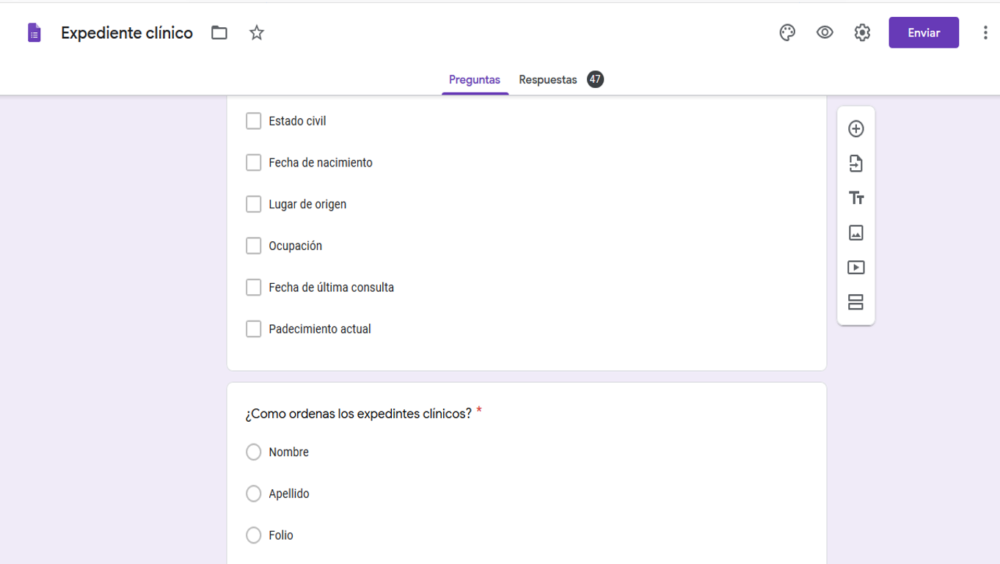
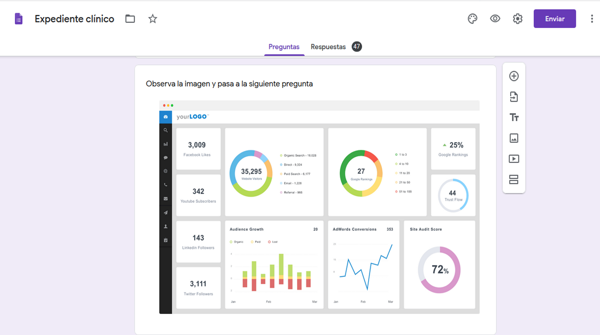

# :bulb: PROCESO CREATIVO 
 El primer paso fue elegir el tema entre las bases de datos que nos fueron proporcionadas. Decidimos trabajar con "Pacientes en EEUU" porque consideramos que orgenar una base de datos así tiene mucha utilidad en el área de los profesionales de la salud.

[Pacientes en EEUU](src/data/patient/patient.json).
 Este set nos proporciona una lista de pacientes de EEUU. Puedes revisar la documentación de su API en este [link](https://r2.smarthealthit.org/Patient).
 
Una base de datos de fácil acceso y consulta sobre pacientes podría ser útil a cualquier área de la salud (medicina,enfermería,estomatología,optometría, psicología,famacéutica,nutrición, etc...)sin importar si los profesionales de las áreas pertinentes se dediquen a la práctica pública o privada. 
  
 ##**ESTUDIO DE USUARIOS**
Nuestro segundo paso fue realizar una encuesta a diversos profesionales de la salud para identificar que datos sobre los pacientes eran más importantes o útiles a la hora de organizar una base de datos médica. Hicimos la encuesta con la finalidad de acercarnos a los usuarios,conocer sus necesidades y perspectivas al momento de utilizar como herramienta de trabajo una base de datos diital.

A continuación el cuestionario:
 
 
 
 
 
 
 

##**RESULTADOS**
Entre los profesionales que repsondieron el cuestionario se encuentran: Odontólogos generales, Odontopediatras, Endodoncistas, Nutriológas, Enfermeras, Psicologos, Médicos y Optometristas.
 

Los datos que solicitan a un paciente para poder llenar una ficha de indentificación son: nombre, edad, dirección, sexo, fecha de nacimiento, estado civil. 
 

En un 61.7% el personla del área de la salud epresó que ordenan los expedientes por apellido del paciente. 
 

El 87.2% dijo que utiliza un expediente clínico de papel y solo el 12.8% utiliza expedientes clínicos digitales.


Padecimiento actual, sexo, fecha de última consulta y lugar de origen son los datos que podrían observarse de manera estadística en las bases de datos médicas.


Los colores que más relacionaban con expdiente clínico digital fueron: azul,verde y blanco. Los cuales fueron tomados a la hora de diseñar la interfaz de usuario. 
 

La última pregunta se colocó para poder implemenar en una futura base de datos, según las necesidades específicas de cada profesional.
 


### UX

- [x] Diseñar la aplicación pensando y entendiendo al usuario.
- [x] Crear prototipos para obtener _feedback_ e iterar.
- [x] Aplicar los principios de diseño visual (contraste, alineación, jerarquía).
- [ ] Planear y ejecutar _tests_ de usabilidad.

### HTML y CSS

- [x] Entender y reconocer por qué es importante el HTML semántico.
- [x] Identificar y entender tipos de selectores en CSS.
- [x] Entender como funciona `flexbox` en CSS.
- [x] Construir tu aplicación respetando el diseño planeado (maquetación).

### DOM

- [ ] Entender y reconocer los selectores del DOM (querySelector | querySelectorAll).
- [ ] Manejar eventos del DOM. (addEventListener)
- [ ] Manipular dinámicamente el DOM. (createElement, appendchild, innerHTML, value)

### Javascript

- [ ] Manipular arrays (`filter` | `map` | `sort` | `reduce`).
- [ ] Manipular objects (key | value).
- [ ] Entender el uso de condicionales (`if-else` | `switch`).
- [ ] Entender el uso de bucles (`for` | `forEach`).
- [ ] Entender la diferencia entre expression y statements.
- [ ] Utilizar funciones (parámetros | argumentos | valor de retorno).
- [ ] Entender la diferencia entre tipos de datos atómicos y estructurados.
- [ ] Utilizar ES Modules (`import` | `export`).

### Pruebas Unitarias (_testing_)
- [ ] Testear funciones (funciones puras).

### Git y GitHub
- [ ] Ejecutar comandos de git (`add` | `commit` | `pull` | `status` | `push`).
- [x] Utilizar los repositorios de GitHub (`clone` | `fork` | gh-pages).
- [x] Colaborar en Github (pull requests).

### Buenas prácticas de desarrollo
- [x] Organizar y dividir el código en módulos (Modularización).
- [x] Utilizar identificadores descriptivos (Nomenclatura | Semántica).
- [ ] Utilizar linter para seguir buenas prácticas (ESLINT).


### Definición del producto

Documenta brevemente tu trabajo en el archivo `README.md` de tu repositorio,
contándonos cómo fue tu proceso de diseño y cómo crees que el producto resuelve
el problema (o problemas) que tiene tu usuario.


```text
.
├── pokemon
|  ├── README.md
├── potter
|  ├── README.md
├── lol
|  ├── README.md
├── src
|  ├── data (según con qué data trabajes)
|  |  ├── lol
|  |  |  ├── lol.js
|  |  |  └── lol.json
|  |  ├── pokemon
|  |  |  ├── pokemon.js
|  |  |  └── pokemon.json
|  |  ├── potter
|  |  |  ├── potter.js
|  |  |  └── potter.json
|  ├── data.js
|  ├── index.html
|  ├── main.js
|  └── style.css
├── test
|  ├── data.spec.js
├── README.md
└── package.json

directory: 9 file: 16
```

### `src/index.html`

Como en el proyecto anterior, existe un archivo `index.html`. Como ya sabes,
acá va la página que se mostrará al usuario. También nos sirve para indicar
qué script se usará y unir todo lo que hemos hecho.

Encontrarás 1 etiqueta inicial, la cual si deseas puedes borrar y empezar de cero:

```
 <div id="root"></div>
```

### `src/main.js`

Acá escribirás todo el código que tenga que ver con la interacción del DOM
(seleccionar, actualizar y manipular elementos del DOM y eventos). Es decir,
en este archivo deberás invocar a tus funciones exportadas en el boilerplate,
según sea necesario para realizar operaciones como creación de nodos,
registro de manejadores de eventos (_event listeners_ o _event handlers_), ....

En este archivo encontrarás una serie de _sentencias_ `import`
_comentadas_. Para _cargar_ las diferentes fuentes de datos tendrás que
_descomentar_ estas _sentencias_. Cada una de estas sentencias importará un
objeto, el cual ya se encuentra exportado en el boilerplate. Este objeto
contiene la data correspondiente a esa fuente de datos.

Por ejemplo, si "descomentamos" la siguiente línea:

```
 /**
 import LoL from './data/lol/lol.js'
 */
```

La línea quedaría así:

```
import LoL from './data/lol/lol.js'
```

Y ahora tendríamos el objeto `LoL` disponible en nuestro archivo (`src/main.js`).

Esta no es la única forma de dividir tu código, puedes usar más archivos y
carpetas, siempre y cuando la estructura sea clara para tus compañeras.


* `filterData(data, condition)`: esta función `filter` o filtrar recibiría la
  data, y nos retornaría aquellos datos que sí cumplan con la condición.

* `sortData(data, sortBy, sortOrder)`: esta función `sort` u ordenar
  recibe tres parámetros.
  El primer parámetro, `data`, nos entrega los datos.
  El segundo parámetro, `sortBy`, nos dice con respecto a cuál de los campos de
  la data se quiere ordenar.
  El tercer parámetro, `sortOrder`, indica si se quiere ordenar de manera
  ascendente o descendente.

* Y así sucesivamente, según tu proyecto en particular.

Estos nombres de funciones y de parámetros son solamente referenciales, lo que
decidas depende de tu propia implementación.


### `src/data`

En esta carpeta están los datos de las diferentes fuentes. Encontrarás una
carpeta por cada fuente, y dentro de cada carpeta dos archivos: uno con la
extensión `.js` y otro `.json`. Ambos archivos contienen la misma data; la
diferencia es que el `.js` lo importaremos como un objeto al archivo main.js,
mientras que el `.json` está ahí para opcionalmente cargar la data de forma
asíncrona con [`fetch()`](https://developer.mozilla.org/es/docs/Web/API/Fetch_API)
(ver sección de [_Parte Opcional_](#6-hacker-edition)).

### `test/data.spec.js`

Tendrás también que completar las pruebas unitarias de las funciones
implementadas en el archivo `data.js`.

## 8. Pistas, tips y lecturas complementarias

### Primeros pasos

Antes de empezar a escribir código, debes definir qué deberá hacer el producto
en base al conocimiento que puedas obtener de tu usuario. Estas preguntas te
pueden ayudar:

* ¿Quiénes son los principales usuarios de producto?
* ¿Cuáles son los objetivos de estos usuarios en relación con el producto?
* ¿Cuáles son los datos más relevantes que quieren ver en la interfaz y por qué?
* ¿Cuándo utilizan o utilizarían el producto?
* Toda tu investigación previa debe tener como resultado todas las Historias
  de Usuario de tu proyecto.
* No hagas los prototipos de alta fidelidad de todas tus Historias. Comienza
  solamente por los que se necesiten para tu Sprint 1 (semana 1 de trabajo). Más
  pistas en la guía de organización para el proyecto.

Cuando ya estés lista para codear, te sugerimos empezar de esta manera:
