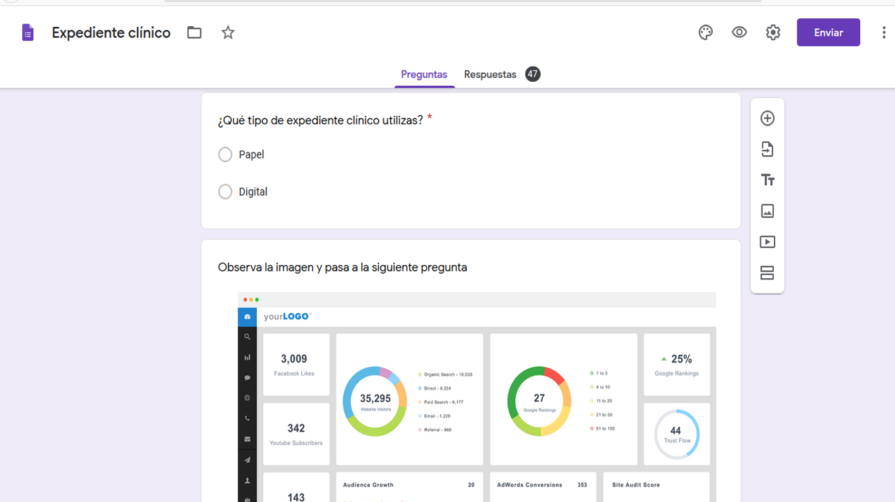
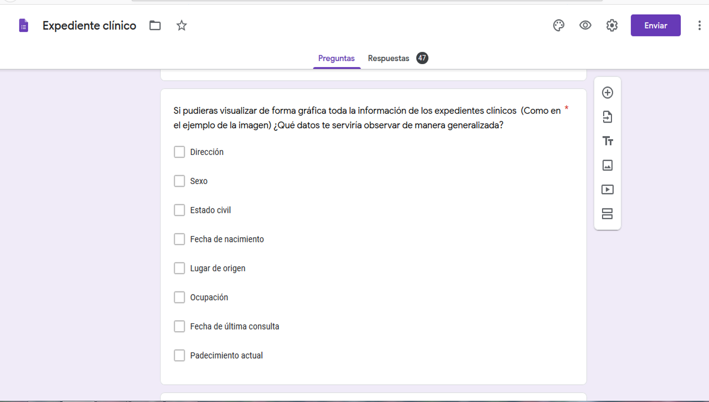

# :syringe: EASY PATIENT DATA

### :bulb: CREATIVE PROCESS

The first step was to choose the topic among the databases that were provided to us. We decided to work with "Patients in the USA" because we consider that ordering such a database is very useful in the area of health professionals.

[EEUU patiens](src/data/patient/patient.json).
This set provides us with a list of US patients. You can check the documentation of its API in this [link](https://r2.smarthealthit.org/Patient).
 
An easily accessible database and consultation on patients could be useful to any area of health (medicine, nursing, stomatology, optometry, psychology, pharmaceuticals, nutrition, etc ...) regardless of whether professionals in the relevant areas are engage in public or private practice.
 

### :question:STUDY OF USERS
 
Our second step was to survey various health professionals to identify which patient data were most important or useful in organizing a medical database. We carried out the survey in order to get closer to the users, to know their needs and perspectives when using a digital database as a working tool.

Here is the questionnaire:

 
 
 
 
 
 
 

### :pencil:RESULTS

Among the professionals who answered the questionnaire are: General Dentists, Pediatric Dentists, Endodontists, Nutriologists, Nurses, Psychologists, Doctors and Optometrists.
 

The data that a patient is asked to fill out an identification form are: name, age, address, sex, date of birth, marital status.
 

In a 61.7% the personnel of the health area expressed that they order the files by the patient's last name. 
 

87.2% said they use a paper clinical record and only 12.8% use digital clinical records.

Current condition, sex, date of last consultation and place of origin are the data that could be statistically observed in medical databases.

The colors that most related to digital clinical record were: blue, green and white. Which were taken at the time of designing the user interface.
 

The last question was placed to be able to implement in a future database, according to the specific needs of each professional.
 

### :rotating_light: PROBLEM

Staff health area daily faces query processing and data in large quantities, either by the number of patients who handles or data collected from each patient; which can become a difficult organization, annoyance and carelessness in the medical database. Furthermore, due to the results of the survey that the medical personnel carry out, it is not very close to digital or new technologies when it comes to administration.

### :computer: WHAT DO WE PROPOSE?

A digital medical database to facilitate patient management and consulting in a small office, clinic, and even a hospital.

### :hourglass_flowing_sand:LET'S DO IT!

To have a homogeneous distribution of the tasks to be carried out, we used the Trello tool, so our SCRUM could be consulted and modified by any of the two team members.
 

### :bust_in_silhouette: USER STORIES

:one: 

ME: As a health professional.

I WANT: easy access to patient data.

TO: expedite the search for the patient identification card.

:two:

ME: As a user of Easy Patient Data

I WANT: to be able to view the website on any device

TO: keep patient data readily accessible

:three:

ME: As a user of Easy Patient Data

I WANT: choose in the mobile version to see the graphs or the table

TO: not saturate myself with information on a small screen

:four: 
ME: As a user of Easy Patient Data

I WANT: to be able to search each patient individually

TO: have access to complete patient data

### :heavy_check_mark: CRITERIA OF ACCEPTANCE

-To stick to the high fidelity prototype

-Complete database

-Filter data: id, name, surname, gender, date of birth, date of death, address, telephone, ethnicity, language.

-Consult and find individual data for each patient.

### :vhs:LOW FIDELITY PROTOTYPE

During this stage we design our user interface with pencil, we order the data based on the results of the questionnaire, we think about the name of our web application, the distribution of the elements to be consulted and what the application screen would look like working on a screen desktop and on a cell phone screen.

 

 

We seek feedback on three occasions from our coaches and also from our bootcamp partners.

### :iphone: HIGH FIDELITY PROTOTYPE

To develop this part we applied the feedback that our coach and our colleagues gave us, as well as taking into account the colors that the health personnel said to associate more with a digital clinical record, which were: blue, green and white. The prototype was developed in Figma.

Prototype for cell phone display developed

Desktop screen prototype developed

### :pushpin:LEARNING OBJECTIVES

 **UX**
- [x] Design the application thinking and understanding the user.
- [x] Prototyping to get _ feedback _ and iterate.
- [x] Apply the principles of visual design (contrast, alignment, hierarchy).
- [x] Plan and run usability tests.

**HTML y CSS**
- [x] Understand and recognize why semantic HTML is important.
- [x] Identify and understand CSS selector types.
- [x] Understand how `flexbox` works in CSS.
- [x] Build your application respecting the planned design (layout).

**DOM**
- [X] Understand and recognize DOM selectors (querySelector | querySelectorAll).
- [X] Handle DOM events.(addEventListener)
- [X] Dynamically manipulate the DOM. (createElement, appendchild, innerHTML, value)

**Javascript**
- [X] Manipulate arrays (`filter` | `map` | `sort` | `reduce`).
- [X] Manipulate objects (key | value).
- [x] Understand the use of conditionals (`if-else` | `switch`).
- [X] Understand the use of loops (`for` | `forEach`).
- [ ] Understand the difference between expression and statements.
- [x] Utilizar funciones (parámetros | argumentos | valor de retorno).
- [ ] Understand the difference between atomic and structured data types.
- [X] ES Modules (`import` | `export`).

**Unit tests (_testing_)**
- [ ] Testear funciones (funciones puras).

 **Git y GitHub**
- [x] Run git commands (`add` | `commit` | `pull` | `status` | `push`).
- [x] Use the GitHub repositories (`clone` | `fork` | gh-pages).
- [x] Colaborar en Github (pull requests).

**Good development practices**
- [x] Organize and divide the code into modules (Modularization).
- [x] Use descriptive identifiers (Nomenclature | Semantics).
- [ ] Use linter to follow good practices (ESLINT).

