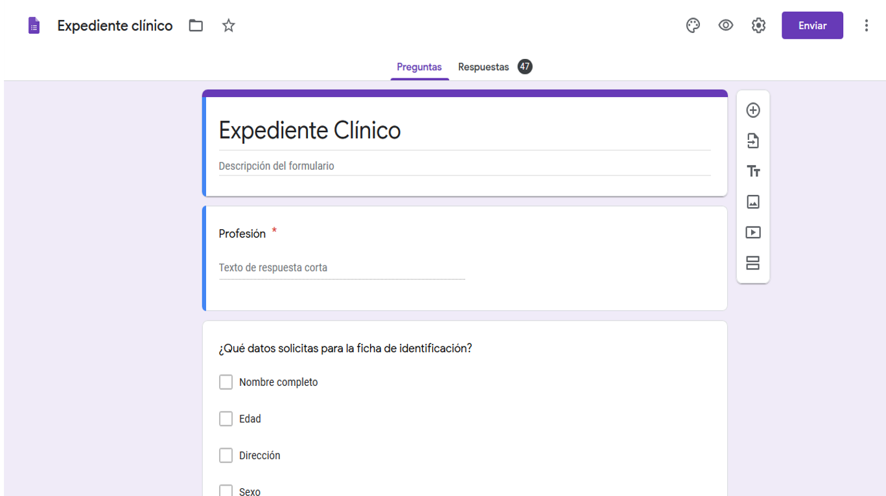
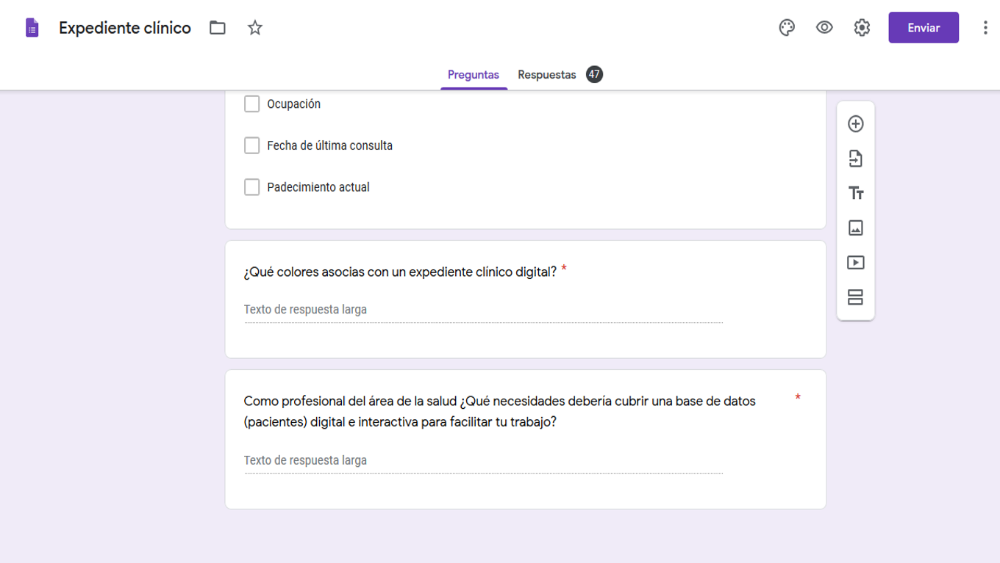

# :syringe: EASY PATIENT DATA

:bulb:**PROCESO CREATIVO**

 El primer paso fue elegir el tema entre las bases de datos que nos fueron proporcionadas. Decidimos trabajar con "Pacientes en EEUU" porque consideramos que orgenar una base de datos así tiene mucha utilidad en el área de los profesionales de la salud.

[Pacientes en EEUU](src/data/patient/patient.json).
 Este set nos proporciona una lista de pacientes de EEUU. Puedes revisar la documentación de su API en este [link](https://r2.smarthealthit.org/Patient).
 
Una base de datos de fácil acceso y consulta sobre pacientes podría ser útil a cualquier área de la salud (medicina,enfermería,estomatología,optometría, psicología,famacéutica,nutrición, etc...)sin importar si los profesionales de las áreas pertinentes se dediquen a la práctica pública o privada. 
  
  

:question: **ESTUDIO DE USUARIOS**
 
Nuestro segundo paso fue realizar una encuesta a diversos profesionales de la salud para identificar que datos sobre los pacientes eran más importantes o útiles a la hora de organizar una base de datos médica. Hicimos la encuesta con la finalidad de acercarnos a los usuarios,conocer sus necesidades y perspectivas al momento de utilizar como herramienta de trabajo una base de datos diital.

A continuación el cuestionario:
 
 
 
 
 
 
 

:pencil: **RESULTADOS**

Entre los profesionales que repsondieron el cuestionario se encuentran: Odontólogos generales, Odontopediatras, Endodoncistas, Nutriológas, Enfermeras, Psicologos, Médicos y Optometristas.
 

Los datos que solicitan a un paciente para poder llenar una ficha de indentificación son: nombre, edad, dirección, sexo, fecha de nacimiento, estado civil. 
 

En un 61.7% el personla del área de la salud expresó que ordenan los expedientes por apellido del paciente. 
 

El 87.2% dijo que utiliza un expediente clínico de papel y solo el 12.8% utiliza expedientes clínicos digitales.

Padecimiento actual, sexo, fecha de última consulta y lugar de origen son los datos que podrían observarse de manera estadística en las bases de datos médicas.

Los colores que más relacionaban con expediente clínico digital fueron: azul,verde y blanco. Los cuales fueron tomados a la hora de diseñar la interfaz de usuario. 
 

La última pregunta se colocó para poder implemenar en una futura base de datos, según las necesidades específicas de cada profesional.
 

### Definición del producto

Documenta brevemente tu trabajo en el archivo `README.md` de tu repositorio,
contándonos cómo fue tu proceso de diseño y cómo crees que el producto resuelve
el problema (o problemas) que tiene tu usuario.

### UX

- [x] Diseñar la aplicación pensando y entendiendo al usuario.
- [x] Crear prototipos para obtener _feedback_ e iterar.
- [x] Aplicar los principios de diseño visual (contraste, alineación, jerarquía).
- [ ] Planear y ejecutar _tests_ de usabilidad.

### HTML y CSS

- [x] Entender y reconocer por qué es importante el HTML semántico.
- [x] Identificar y entender tipos de selectores en CSS.
- [x] Entender como funciona `flexbox` en CSS.
- [x] Construir tu aplicación respetando el diseño planeado (maquetación).

### DOM

- [ ] Entender y reconocer los selectores del DOM (querySelector | querySelectorAll).
- [ ] Manejar eventos del DOM. (addEventListener)
- [ ] Manipular dinámicamente el DOM. (createElement, appendchild, innerHTML, value)

### Javascript

- [ ] Manipular arrays (`filter` | `map` | `sort` | `reduce`).
- [ ] Manipular objects (key | value).
- [ ] Entender el uso de condicionales (`if-else` | `switch`).
- [ ] Entender el uso de bucles (`for` | `forEach`).
- [ ] Entender la diferencia entre expression y statements.
- [ ] Utilizar funciones (parámetros | argumentos | valor de retorno).
- [ ] Entender la diferencia entre tipos de datos atómicos y estructurados.
- [ ] Utilizar ES Modules (`import` | `export`).

### Pruebas Unitarias (_testing_)
- [ ] Testear funciones (funciones puras).

### Git y GitHub
- [ ] Ejecutar comandos de git (`add` | `commit` | `pull` | `status` | `push`).
- [x] Utilizar los repositorios de GitHub (`clone` | `fork` | gh-pages).
- [x] Colaborar en Github (pull requests).

### Buenas prácticas de desarrollo
- [x] Organizar y dividir el código en módulos (Modularización).
- [x] Utilizar identificadores descriptivos (Nomenclatura | Semántica).
- [ ] Utilizar linter para seguir buenas prácticas (ESLINT).

